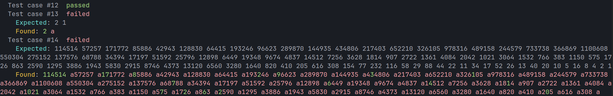
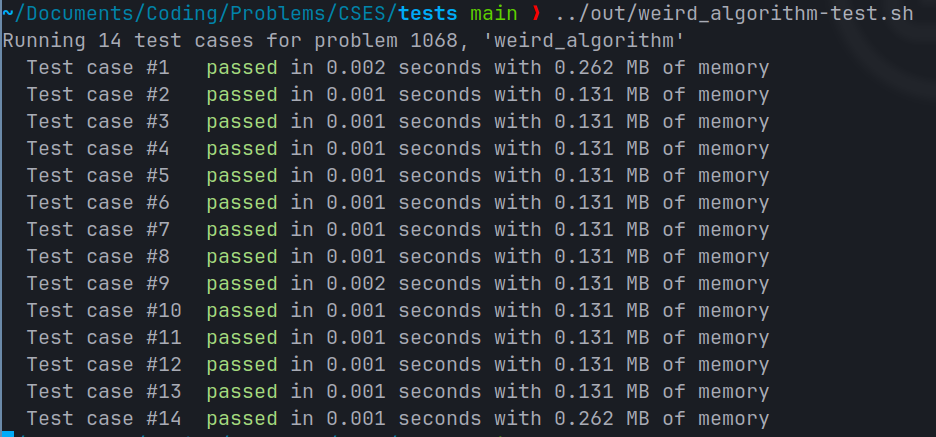

# CSESProblemSetTests

This repository contains all 400 tests for the [CSES Problem Set](https://cses.fi/problemset/).
The `tests` directory contains one folder for each problem, named according to the task number, and each folder
one `zip` file, with the same name as the folder.

## Usage

You can directly use the `tests.py` script, although running it manually is a bit of a hassle.
Running `python tests.py <taskNumber> <pathToExecutable>` will attempt to run tests for a given executable,
assuming that the executable is a solution for the problem with ID `<taskNumber>`. In order to find the task number
for a problem, simply go to the problem's web page, and the task number will be at the end of the URL.
For example, for "Missing Number" (with URL
[https://cses.fi/problemset/task/1083](https://cses.fi/problemset/task/1083)), the task number is `1083`.
Input is piped from the executable's `stdin`, and output from the executable's `stdout`. It's important that
the `tests` directory stays in the same directory as `tests.py`, that way it can read the tests from there.
When you try to run tests for task `XXXX`, the script will try to extract `tests/XXXX/XXXX.zip` if there are no `.in`
and `.out` files. Once those files exist, they will be read and the executable's output will be compared with a `.out`
file for each test.

If a test case fails, both the expected output and the actual output will be displayed.

### Fetching new tests

If, for some reason, you would like to redownload the tests, you can run the `fetch_all.py` script. In order for the
POST requests to work, you must set the `CSRF_TOKEN` and `PHPSESSID` environment variables. In order to find those,
you have to open your browser, open the developer tools, and go to the network tab. Once you're there, download any
test, for example from [here](https://cses.fi/problemset/tests/1068/). A POST request should appear in the network
tab. From there you can retrieve the `CSRF_TOKEN` by clicking on the request and clicking on the request tab.
Similarly, `PHPSESSID` can be found in the cookies tab.

## Usage with build tools

With a build tool of your choice, you can create shell scripts that will automatically run tests for a given problem,
which avoids having to enter the task number and executable path each time.
I've provided an example of this with CMake:

```cmake
set(CMAKE_RUNTIME_OUTPUT_DIRECTORY ${CMAKE_BINARY_DIR}/out)

# Helper function that generates executable and test script
function(problem name taskNumber)
  # Create executable
  add_executable(${name} ${CMAKE_SOURCE_DIR}/problems/${name}.cpp)

  set(TEST_FILE "${CMAKE_RUNTIME_OUTPUT_DIRECTORY}/${name}-test.sh")
  # Create shell script that calls `tests.py`
  file(
    WRITE ${TEST_FILE}
    "#!/bin/sh\n\npython3 ${CMAKE_SOURCE_DIR}/tests/tests.py ${taskNumber} ${CMAKE_RUNTIME_OUTPUT_DIRECTORY}/${name}"
  )
  # Make script executable by everybody
  file(
    CHMOD
    ${TEST_FILE}
    FILE_PERMISSIONS
    OWNER_EXECUTE
    OWNER_READ
    OWNER_WRITE
    GROUP_EXECUTE
    GROUP_READ
    GROUP_WRITE
    WORLD_EXECUTE
    WORLD_READ)
endfunction()

# Add problems
problem(weird_algorithm 1068)
problem(missing_number 1083)
problem(repetitions 1069)
problem(increasing_array 1094)
problem(permutations 1070)
problem(number_spiral 1071)
```

## Example output

The `tests.py` script outputs colored text, which makes the output a lot more readable.


